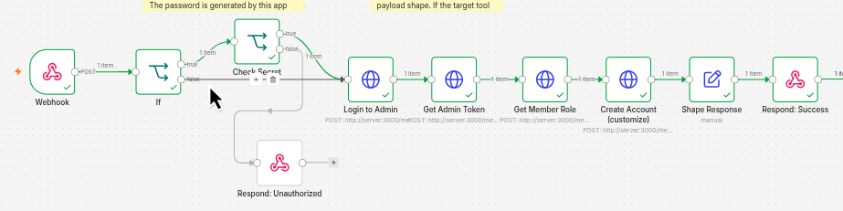
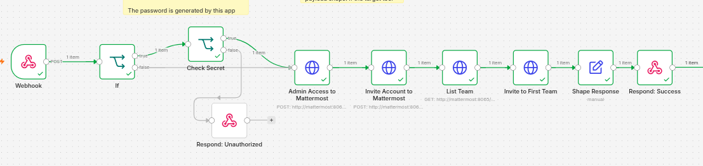

# Flowable Account Provisioning Specification (DEV-868 & DEV-869)

## 1. Overview
This repository provides automated n8n workflows that provision user accounts with appropriate default roles in internal tools whenever a central provisioning webhook is triggered.

Every tool-specific workflow originates from the canonical base template (`template/flowable-provisioning-workflow.json`), ensuring uniform authentication validation, response shaping, and error handling across integrations.

- **DEV-868**: Account Provisioning Base Framework & Ingress Security
- **DEV-869**: Twenty CRM Account Provisioning Integration
- **DEV-870**: Mat

---

## 2. Ingress Contract

All provisioning requests enter through a standardized HTTP webhook endpoint configured on the n8n automate service.

- **Endpoint**: `POST /webhook/provision-account` (or `POST /webhook-test/provision-account` during testing)
- **Headers**:
  - `Content-Type: application/json`
  - `x-provisioning-key`: `<PROVISIONING_SECRET>` (shared webhook authentication secret)

### Request Payload Schema
```json
{
  "employeeEmail": "employee@example.com",
  "employeeName": "Jane Doe",
  "password": "TemporaryOrGeneratedPassword"
}
```

| Field | Type | Description |
|---|---|---|
| `employeeEmail` | `string` | The work email address for the user account (required). |
| `employeeName` | `string` | The full name of the employee (required). |
| `password` | `string` | Generated temporary password (optional/tool-dependent; see tool-specific notes). |

---

## 3. Error Handling & Status Codes

All workflows follow consistent HTTP status and error contracts:

### HTTP 201 Created (Success)
Returned when user provisioning or invitation succeeds.

- **Status Code**: `201 Created`
- **Response Body**:
```json
{
  "username": "employee@example.com"
}
```
*Note: The `username` field returns the identifier created or mapped in the target tool (typically the employee email).*

### HTTP 401 Unauthorized (Auth Failure)
Returned when secret verification fails (invalid or missing `x-provisioning-key`).

- **Status Code**: `401 Unauthorized`
- **Response Body**:
```json
{
  "error": "Unauthorized"
}
```

---

## 4. Local Fast-Iteration Switch (`PROVISIONING_SECRET_REQUIRED`)

To streamline local testing and iterative development without sending authentication headers repeatedly, workflows support a bypass switch:

- **Environment Variable**: `PROVISIONING_SECRET_REQUIRED`
- **Default (Production / Hardened)**: `true`
- **Behavior**:
  - When `true`: The workflow routes incoming requests from the `Webhook` node to the `If` node, which evaluates `PROVISIONING_SECRET_REQUIRED`. Since it is true, requests route through the `Check Secret` node, verifying that `$json.headers['x-provisioning-key'] === $env.PROVISIONING_SECRET`. Requests with missing or invalid keys return `HTTP 401 Unauthorized`.
  - When `false`: The `If` node bypasses `Check Secret` entirely and routes directly to the tool provisioning sequence (`Create Account` / `Login to Admin`).

---

## 5. Provisionings Features

### Twenty CRM Integration (DEV-869)

The Twenty CRM workflow (`template/Flowable Account Provisioning - Twenty CRM.json`) provisions new workspace members automatically.

#### Architecture & Invocation Flow
Due to permission boundaries and API structures in Twenty CRM, standard admin API keys cannot perform workspace member creation on the primary `/graphql` endpoint (which returns `403 Forbidden`). Instead, the workflow orchestrates user admin authentication against Twenty CRM's `/metadata` endpoint (internally addressed as `http://server:3000/metadata` within Docker Compose, with `$env.SERVER_URL` passed as the client `origin` variable):

1. **`Login to Admin`**:
   - Calls `mutation getLoginTokenFromCredentials` against `http://server:3000/metadata` using `$env.TWENTY_ADMIN_EMAIL`, `$env.TWENTY_ADMIN_PASSWORD`, and origin `$env.SERVER_URL`.
   - Obtains a short-lived `loginToken`.
2. **`Get Admin Token`**:
   - Calls `mutation getAuthTokensFromLoginToken` against `http://server:3000/metadata` using the `loginToken` and origin `$env.SERVER_URL`.
   - Obtains the admin session token (`accessOrWorkspaceAgnosticToken`).
3. **`Get Member Role`**:
   - Calls `query GetRoles` against `http://server:3000/metadata` with bearer authorization.
   - Dynamically resolves the role ID where `label === "Member"` (`$json.data.getRoles.find(item => item.label === "Member")?.id`).
4. **`Create Account (customize)` / Send Invitations**:
   - Executes `mutation SendInvitations` against `http://server:3000/metadata` passing `$json.body.employeeEmail` and the dynamically resolved `roleId`.
5. **`Shape Response` & `Respond: Success`**:
   - Normalizes response to `{ "username": employeeEmail }` and returns `HTTP 201 Created`.

#### Password Handling Bypass
The `password` parameter sent in the ingress webhook is **received but intentionally ignored**:
- Twenty CRM's member invitation API (`sendInvitations`) does not support setting passwords directly.
- The invited user receives an email invitation containing a secure link to accept and configure their own password.
- Any password supplied in the webhook payload is safely discarded and never transmitted or logged.

#### Workflow Diagram & Acceptances


- Acceptance: [New member created in workspace](../daily/20260913_DEV-869_Acceptances/twentycrm-invited.png)
- Acceptance: [Assigned standard Member role](../daily/20260913_DEV-869_Acceptances/twentycrm-invited.png)
- Acceptance: [Unauthorized request rejection](../daily/20260913_DEV-869_Acceptances/request.png)

---

### Mattermost Integration (DEV-870)

The Mattermost workflow (`template/Flowable Account Provisioning - Mattermost.json`) provisions new team members automatically.

#### Architecture & Invocation Flow
Mattermost's `/api/v4/users` endpoint requires an authenticated admin session (open signup is disabled), so the workflow first authenticates as admin before creating the account:

1. **`If` / `Check Secret`**:
   - Validates `x-provisioning-key` header against `$env.PROVISIONING_SECRET` (only when `$env.PROVISIONING_SECRET_REQUIRED` is true).
   - Rejects with `401 Unauthorized` on mismatch.
2. **`Admin Access to Mattermost`**:
   - Calls `POST /api/v4/users/login` against `http://mattermost:8065` using `$env.MATTERMOST_ADMIN_EMAIL` and `$env.MATTERMOST_ADMIN_PASSWORD`.
   - Obtains the session token from the response `Token` header.
3. **`Invite Account to Mattermost` (Create Account, customize)**:
   - Calls `POST /api/v4/users` with bearer token, using `employeeEmail`/`password` from the webhook body and a derived `username` (email prefix).
   - Creates the account with default system role `system_user`.
4. **`List Team`**:
   - Calls `GET /api/v4/teams` with bearer token to resolve the target team ID.
5. **`Invite to First Team`**:
   - Calls `POST /api/v4/teams/{team_id}/members` passing `team_id` and the created `user_id`.
   - Adds the user with default team role `team_user`.
6. **`Shape Response` & `Respond: Success`**:
   - Normalizes response to `{ "username": createdUsername }` and returns `HTTP 201 Created`.

#### Workflow Diagram & Acceptances


- Acceptance: [Account created with `system_user` role](../daily/20260927_DEV-870_Acceptances/mm-invited-role.png)
- Acceptance: [Assigned standard `team_user` role on team](../daily/20260927_DEV-870_Acceptances/mm-system-console.png)
- Acceptance: [Unauthorized request rejection](../daily/20260927_DEV-870_Acceptances/mm-allrequests.png)

## 6. Environment Variables

The following environment variables configure the provisioning service and its integration dependencies:

| Variable | Required | Default | Description |
|---|---|---|---|
| `PROVISIONING_SECRET` | Yes (in prod) | — | Shared secret token expected in the `x-provisioning-key` header. |
| `PROVISIONING_SECRET_REQUIRED` | No | `true` | When `true`, enforces secret check. Set to `false` for local test bypass. |
| `N8N_BLOCK_ENV_ACCESS_IN_NODE` | No | `false` | Must be `false` to allow n8n workflow expressions to read `$env.*`. |
| `SERVER_URL` | No | `http://localhost:3000` | Public base URL / origin of the Twenty CRM server instance passed to token mutations. |
| `TWENTY_ADMIN_EMAIL` | Yes (Twenty CRM) | — | Admin email used to authenticate Twenty CRM invite mutations. |
| `TWENTY_ADMIN_PASSWORD` | Yes (Twenty CRM) | — | Admin password used to authenticate Twenty CRM invite mutations. |

---

## 7. Workflow Templates

- **`template/flowable-provisioning-workflow.json`**: Canonical base template for all new tool integrations, preconfigured with webhook ingress, `PROVISIONING_SECRET_REQUIRED` switch, secret authentication, and 201/401 response nodes.
- **`template/Flowable Account Provisioning - Twenty CRM.json`**: Complete, production-ready integration workflow for Twenty CRM.
- **`template/Flowable Account Provisioning - Mattermost.json`**: Complete, production-ready integration workflow for Mattermost.

---

## 8. Development History & Technical Notes

### Progress Log
| Date | Milestone | Reference |
|---|---|---|
| 10 Sep 2026 | Base configuration, Docker Compose setup, and repository creation | [Repository](https://github.com/ReyzuaWeh/automate-account-provisioning) |
| 12 Sep 2026 | Initial Twenty CRM investigation; identified API key permission boundary | [Role Permission Issue](../daily/20260912/twentycrm-forbidden.png) |
| 13 Sep 2026 | Resolved Twenty CRM member invitation via `/metadata` user admin mutation | [DEv-869 - Acceptance Evidence](../daily/20260913_DEV-869_Acceptances/) |
| 27 Sep 2026 | Create automation invitation for Mattermost. DEV-870 | [DEV-870 Acceptance Evidence](../daily/20260927_DEV-870_Acceptances/) |

### Technical Problem & Resolution: Twenty CRM Permissions
When invoking `CreateWorkspaceMember` on `/graphql` using an API key, Twenty CRM rejects the request with `403 Forbidden` because API keys lack workspace membership management capabilities.

**Resolution**:
Send invitations via the `/metadata` endpoint using `sendInvitations`:
```graphql
mutation SendInvitations($emails: [String!]!, $roleId: UUID) {
  sendInvitations(emails: $emails, roleId: $roleId) {
    success
    errors
    result {
      ... on WorkspaceInvitation {
        id
        email
        roleId
        expiresAt
      }
    }
  }
}
```
This requires an admin user token obtained through `getLoginTokenFromCredentials` and `getAuthTokensFromLoginToken`.
