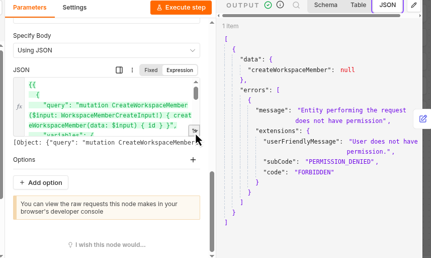

# Overview
Setting an n8n workflows that automatically create a user account — with the correct
default role — in each of our internal tools whenever a provisioning webhook is triggered.
Every workflow starts from the same base template (flowable-provisioning-workflow.json,
attached to this ticket) rather than being built from scratch.

CODE : *DEV-868*

# Daily Progress
| Date | Summary | Evicdence |
| --- | --- | --- |
| 10 September 2026 | Create a base configuration, docker compose file, and github repository | [Github Repository](https://github.com/ReyzuaWeh/automate-account-provisioning) |
| 11 September 2026 | Planning to continue task for TwentyCRM config (DEV-869). However, there's an issue I found about role's permission | [Role Permission Problem](../daily/20260912/twentycrm-forbidden.png)

# Development Struggle
## Twenty CRM
1. Forbidden Permission

Can't add member due to forbidden. It's actually has used api key from admin, still the problem still remain. Haven't found any solutiun for it now.

