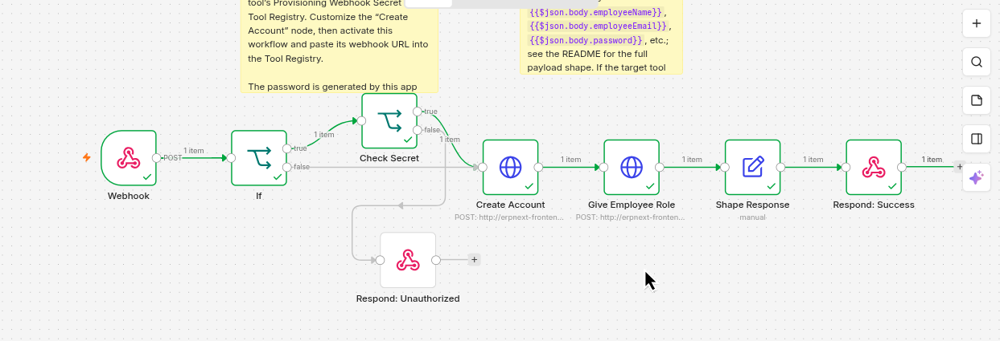
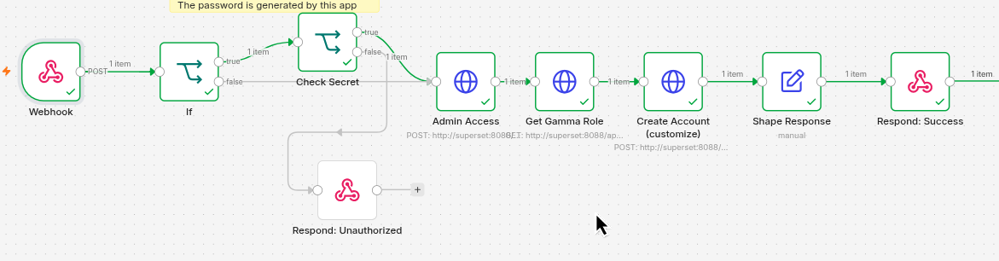
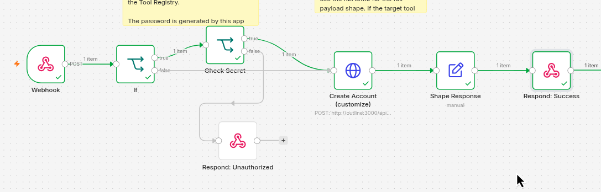
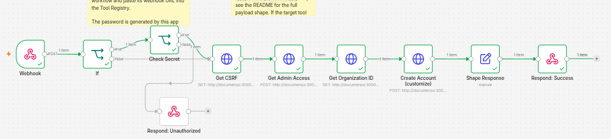

# Flowable Account Provisioning Specification (DEV-868 & DEV-869)

## 1. Overview
This repository provides automated n8n workflows that provision user accounts with appropriate default roles in internal tools whenever a central provisioning webhook is triggered.

Every tool-specific workflow originates from the canonical base template (`template/flowable-provisioning-workflow.json`), ensuring uniform authentication validation, response shaping, and error handling across integrations.

- **DEV-868**: Account Provisioning Base Framework & Ingress Security
- **DEV-869**: Twenty CRM Account Provisioning Integration
- **DEV-870**: Mattermost Account Provisioning Integration
- **DEV-871**: NextERP (ERPNext) Account Provisioning Integration
- **DEV-872**: Superset Account Provisioning Integration
- **DEV-873**: Outline Account Provisioning Integration
- **DEV-874**: Documenso Account Provisioning Integration

---

## 2. Ingress Contract

All provisioning requests enter through a standardized HTTP webhook endpoint configured on the n8n automate service.

- **Endpoint**: `POST /webhook/provision-account` (or `POST /webhook-test/provision-account` during testing)
- **Headers**:
  - `Content-Type: application/json`
  - `x-provisioning-key`: `<PROVISIONING_SECRET>` (shared webhook authentication secret)

### Request Payload Schema
```json
{
  "employeeEmail": "employee@example.com",
  "employeeName": "Jane Doe",
  "password": "TemporaryOrGeneratedPassword"
}
```

| Field | Type | Description |
|---|---|---|
| `employeeEmail` | `string` | The work email address for the user account (required). |
| `employeeName` | `string` | The full name of the employee (required). |
| `password` | `string` | Generated temporary password (optional/tool-dependent; see tool-specific notes). |

---

## 3. Error Handling & Status Codes

All workflows follow consistent HTTP status and error contracts:

### HTTP 201 Created (Success)
Returned when user provisioning or invitation succeeds.

- **Status Code**: `201 Created`
- **Response Body**:
```json
{
  "username": "employee@example.com"
}
```
*Note: The `username` field returns the identifier created or mapped in the target tool (typically the employee email).*

### HTTP 401 Unauthorized (Auth Failure)
Returned when secret verification fails (invalid or missing `x-provisioning-key`).

- **Status Code**: `401 Unauthorized`
- **Response Body**:
```json
{
  "error": "Unauthorized"
}
```

---

## 4. Local Fast-Iteration Switch (`PROVISIONING_SECRET_REQUIRED`)

To streamline local testing and iterative development without sending authentication headers repeatedly, workflows support a bypass switch:

- **Environment Variable**: `PROVISIONING_SECRET_REQUIRED`
- **Default (Production / Hardened)**: `true`
- **Behavior**:
  - When `true`: The workflow routes incoming requests from the `Webhook` node to the `If` node, which evaluates `PROVISIONING_SECRET_REQUIRED`. Since it is true, requests route through the `Check Secret` node, verifying that `$json.headers['x-provisioning-key'] === $env.PROVISIONING_SECRET`. Requests with missing or invalid keys return `HTTP 401 Unauthorized`.
  - When `false`: The `If` node bypasses `Check Secret` entirely and routes directly to the tool provisioning sequence (`Create Account` / `Login to Admin`).

---

## 5. Provisionings Features

### Twenty CRM Integration (DEV-869)

The Twenty CRM workflow (`template/Flowable Account Provisioning - Twenty CRM.json`) provisions new workspace members automatically.

#### Architecture & Invocation Flow
Due to permission boundaries and API structures in Twenty CRM, standard admin API keys cannot perform workspace member creation on the primary `/graphql` endpoint (which returns `403 Forbidden`). Instead, the workflow orchestrates user admin authentication against Twenty CRM's `/metadata` endpoint (internally addressed as `http://server:3000/metadata` within Docker Compose, with `$env.SERVER_URL` passed as the client `origin` variable):

1. **`Login to Admin`**:
   - Calls `mutation getLoginTokenFromCredentials` against `http://server:3000/metadata` using `$env.TWENTY_ADMIN_EMAIL`, `$env.TWENTY_ADMIN_PASSWORD`, and origin `$env.SERVER_URL`.
   - Obtains a short-lived `loginToken`.
2. **`Get Admin Token`**:
   - Calls `mutation getAuthTokensFromLoginToken` against `http://server:3000/metadata` using the `loginToken` and origin `$env.SERVER_URL`.
   - Obtains the admin session token (`accessOrWorkspaceAgnosticToken`).
3. **`Get Member Role`**:
   - Calls `query GetRoles` against `http://server:3000/metadata` with bearer authorization.
   - Dynamically resolves the role ID where `label === "Member"` (`$json.data.getRoles.find(item => item.label === "Member")?.id`).
4. **`Create Account (customize)` / Send Invitations**:
   - Executes `mutation SendInvitations` against `http://server:3000/metadata` passing `$json.body.employeeEmail` and the dynamically resolved `roleId`.
5. **`Shape Response` & `Respond: Success`**:
   - Normalizes response to `{ "username": employeeEmail }` and returns `HTTP 201 Created`.

#### Password Handling Bypass
The `password` parameter sent in the ingress webhook is **received but intentionally ignored**:
- Twenty CRM's member invitation API (`sendInvitations`) does not support setting passwords directly.
- The invited user receives an email invitation containing a secure link to accept and configure their own password.
- Any password supplied in the webhook payload is safely discarded and never transmitted or logged.

#### Workflow Diagram & Acceptances


- Acceptance: [New member created in workspace](../daily/20260913_DEV-869_Acceptances/twentycrm-invited.png)
- Acceptance: [Assigned standard Member role](../daily/20260913_DEV-869_Acceptances/twentycrm-invited.png)
- Acceptance: [Unauthorized request rejection](../daily/20260913_DEV-869_Acceptances/request.png)

---

### Mattermost Integration (DEV-870)

The Mattermost workflow (`template/Flowable Account Provisioning - Mattermost.json`) provisions new team members automatically.

#### Architecture & Invocation Flow
Mattermost's `/api/v4/users` endpoint requires an authenticated admin session (open signup is disabled), so the workflow first authenticates as admin before creating the account:

1. **`If` / `Check Secret`**:
   - Validates `x-provisioning-key` header against `$env.PROVISIONING_SECRET` (only when `$env.PROVISIONING_SECRET_REQUIRED` is true).
   - Rejects with `401 Unauthorized` on mismatch.
2. **`Admin Access to Mattermost`**:
   - Calls `POST /api/v4/users/login` against `http://mattermost:8065` using `$env.MATTERMOST_ADMIN_EMAIL` and `$env.MATTERMOST_ADMIN_PASSWORD`.
   - Obtains the session token from the response `Token` header.
3. **`Invite Account to Mattermost` (Create Account, customize)**:
   - Calls `POST /api/v4/users` with bearer token, using `employeeEmail`/`password` from the webhook body and a derived `username` (email prefix).
   - Creates the account with default system role `system_user`.
4. **`List Team`**:
   - Calls `GET /api/v4/teams` with bearer token to resolve the target team ID.
5. **`Invite to First Team`**:
   - Calls `POST /api/v4/teams/{team_id}/members` passing `team_id` and the created `user_id`.
   - Adds the user with default team role `team_user`.
6. **`Shape Response` & `Respond: Success`**:
   - Normalizes response to `{ "username": createdUsername }` and returns `HTTP 201 Created`.

#### Workflow Diagram & Acceptances


- Acceptance: [Account created with `system_user` role](../daily/20260927_DEV-870_Acceptances/mm-invited-role.png)
- Acceptance: [Assigned standard `team_user` role on team](../daily/20260927_DEV-870_Acceptances/mm-system-console.png)
- Acceptance: [Unauthorized request rejection](../daily/20260927_DEV-870_Acceptances/mm-allrequests.png)


### NextERP Integration (DEV-871)

The NextERP workflow (`template/Flowable Account Provisioning - NextERP.json`) provisions new team members automatically.

#### Architecture & Invocation Flow
NextERP (ERPNext) `/api/resource/User` requires an API token, and the `Employee` role is only retained if the user is linked to an `Employee` record. The workflow therefore creates the User first, then the linked Employee:

1. **`If` / `Check Secret`**:
   - `If` checks `$env.PROVISIONING_SECRET_REQUIRED`. When true, the request goes to `Check Secret`; otherwise it goes straight to `Create Account`.
   - `Check Secret` validates the `x-provisioning-key` header against `$env.PROVISIONING_SECRET`.
   - Mismatch → `Respond: Unauthorized` returns `401 Unauthorized`.
2. **`Create Account` (customize)**:
   - Calls `POST http://erpnext-frontend:8080/api/resource/User` (same Docker network as the ERPNext frontend).
   - Auth: header `Authorization: token $env.NEXT_ERP_TOKEN` (format `API_KEY:API_SECRET`, generated from a dedicated integration user under User → API Access → Generate Keys).
   - Body (JSON mode, `roles` must be an array of objects):
```json
     {
       "email": "{{ $json.body.employeeEmail }}",
       "first_name": "{{ $json.body.employeeName }}",
       "new_password": "{{ $json.body.password }}",
       "send_welcome_email": 0,
       "gender": "Male",
       "roles": [{"role": "Employee"}]
     }
```
   - Creates the account with role `Employee` only (no System Manager / HR Manager / Accounts Manager).
3. **`Give Employee Role`**:
   - Calls `POST http://erpnext-frontend:8080/api/resource/Employee`, using the User response (`$json.data.first_name`, `$json.data.email`) to link `user_id`.
   - Required because ERPNext removes the `Employee` role from users without a mapped Employee ("Removed Employee role as there is no mapped employee").
   - Body:
```json
     {
       "first_name": "{{ $json.data.first_name }}",
       "user_id": "{{ $json.data.email }}",
       "gender": "Male",
       "date_of_birth": "1990-01-01",
       "date_of_joining": "{{ $today.toFormat('yyyy-MM-dd') }}",
       "status": "Active"
     }
```
   - `gender`, `date_of_birth`, `date_of_joining` are standard mandatory fields (cannot be made optional via Customize Form). Values are **placeholders** to be completed by HR, since the webhook only supplies name/email/password.
4. **`Shape Response` & `Respond: Success`**:
   - `Shape Response` sets `username` from the webhook `employeeEmail` (the ERPNext login identifier is the email, i.e. the User `name` field; verified by test login).
   - Returns `{ "username": "<email>" }` with `HTTP 201 Created`.

#### Configuration
| Item | Value |
|------|-------|
| Endpoints | `POST /api/resource/User`, `POST /api/resource/Employee` |
| Base URL | `http://erpnext-frontend:8080` (use `http://`, not `https://`) |
| Auth | `Authorization: token <API_KEY>:<API_SECRET>` |
| Env vars | `NEXT_ERP_TOKEN` it's `<API_KEY>:<API_SECRET>`, `PROVISIONING_SECRET`, `PROVISIONING_SECRET_REQUIRED` |

#### Verification
- List users / check role: `GET /api/resource/User/<email>?fields=["name","roles"]` or `http://localhost:8080/app/user/<email>`.
- Check Employee link: `http://localhost:8080/app/employee?user_id=<email>`.
- Login test: sign in at `http://localhost:8080/login` using the email and provided password.

#### Notes
- **Module Profile**: the default (all modules visible) was confirmed with the ERPNext admin owner as `<intended / narrowed to ...>`. Module Profile controls module visibility, not permissions.
- Placeholder Employee fields (`gender`, `date_of_birth`, `date_of_joining`) are mandatory in ERPNext and cannot be made optional via Customize Form. They are set to default values and should be updated by HR after account creation.
- You may get `NEXT_ERP_TOKEN` by creating a dedicated integration user in ERPNext, then generating API keys for that user (User → API Access → Generate Keys). Use the format `<API_KEY>:<API_SECRET>` as the token.

#### Workflow Diagram & Acceptances


- Acceptance: [Endpoint/auth documented in ticket and README](#architecture--invocation-flow)
- Acceptance: [Account created with `Employee` role (non-admin) in admin UI](../daily/20260929_DEV-871_Acceptances/nexterp-user-role.png)
- Acceptance: [Module Profile default confirmed with NextERP admin owner](../daily/20260929_DEV-871_Acceptances/nexterp-user-modules.png)
- Acceptance: [Unauthorized request rejection (wrong secret → 401)](../daily/20260929_DEV-871_Acceptances/nexterp-requests.png)

### Superset Integration (DEV-872)

The Superset workflow (`template/Flowable Account Provisioning - SuperSet.json`) provisions new team members automatically with a view-only role.

#### Architecture & Invocation Flow
Superset's `/api/v1/security/users/` endpoint requires an authenticated admin JWT and `FAB_ADD_SECURITY_API = True` in `superset_config.py`, so the workflow first authenticates as admin before creating the account:

1. **`If` / `Check Secret`**:
   - Validates `x-provisioning-key` header against `$env.PROVISIONING_SECRET` (only when `$env.PROVISIONING_SECRET_REQUIRED` is true).
   - Rejects with `401 Unauthorized` on mismatch.
2. **`Admin Access`**:
   - Calls `POST /api/v1/security/login` against `http://superset:8088` using `$env.SUPERSET_ADMINNAME` and `$env.SUPERSET_ADMINPASSWORD` with `provider: "db"`.
   - Obtains the JWT from the response `access_token` field.
3. **`Get Gamma Role`**:
   - Calls `GET /api/v1/security/roles/search/` with bearer token and the filter `q=(filters:!((col:name,opr:eq,value:Gamma)))` to resolve the Gamma role ID (`ids`).
4. **`Create Account (customize)`**:
   - Calls `POST /api/v1/security/users/` with bearer token, using `employeeName`/`employeeEmail`/`password` from the webhook body.
   - Derives `first_name` (first word), `last_name` (remaining words), and `username` (name lowercased, spaces replaced by `.`).
   - Creates the account as `active: true` with only the default role `Gamma` (view-only; no access to any dataset until explicitly granted). Admin and Alpha are never assigned.
5. **`Shape Response` & `Respond: Success`**:
   - Normalizes response to `{ "username": createdUsername }` and returns `HTTP 201 Created`.

#### Prerequisites
- `FAB_ADD_SECURITY_API = True` in `superset_config.py`.
- `automate-service` environment includes `SUPERSET_ADMINNAME` and `SUPERSET_ADMINPASSWORD`.
- A dedicated admin/service account is used for provisioning, not a personal admin account.

#### Workflow Diagram & Acceptances


- Acceptance: [Account created with `Gamma` role only](../daily/20261001/superset-user-role.png)
- Acceptance: [User sees no dashboard/dataset until granted access](../daily/20261001/superset-dashboard-dataset.png)
- Acceptance: [Unauthorized request rejection](../daily/20261001/superset-requests.png)

### Outline Integration (DEV-873)

The Outline workflow (`template/Flowable Account Provisioning - Outline.json`) invites new team members automatically with the standard `member` role.

#### Architecture & Invocation Flow
Outline is invite/SSO based and has no password-provisioned account creation. The workflow therefore uses Outline's invite endpoint with an admin API key (`http://outline:3000` within Docker Compose):

1. **`If` / `Check Secret`**:
   - Validates `x-provisioning-key` header against `$env.PROVISIONING_SECRET` (only when `$env.PROVISIONING_SECRET_REQUIRED` is true).
   - Rejects with `401 Unauthorized` on mismatch.
2. **`Create Account (customize)` / Invite User**:
   - Calls `POST /api/users.invite` against `http://outline:3000` with `Authorization: Bearer $env.OUTLINE_API_KEY`.
   - Sends `invites: [{ email, name, role: "member" }]` using `employeeEmail` and `employeeName` from the webhook body.
   - Role is fixed to `member` (read/write). Never `admin`, `viewer`, or `guest`.
3. **`Shape Response` & `Respond: Success`**:
   - Normalizes response to `{ "username": employeeEmail }` and returns `HTTP 201 Created`.

#### Getting the API Key
The key belongs to an admin user and must be created manually once:
1. Log in to Outline as an admin (local test: magic link is delivered to Mailpit at `http://localhost:8025`).
2. Open **Settings → API & Apps → New API key**, give it a name (e.g. `n8n-provisioner`), and copy the token (`ol_api_...`). It is shown only once.
3. Save it in `.env` as `OUTLINE_API_KEY=ol_api_...`.
4. Expose it to n8n in `docker-compose.yml` under `automate-service`:
   - `OUTLINE_URL=http://outline:3000`
   - `OUTLINE_API_KEY=${OUTLINE_API_KEY}`
5. Recreate the service: `docker compose up -d --force-recreate automate-service`.

Use a dedicated admin/service account for the key, not a personal one. A wrong or missing key makes Outline return `401`.

#### Password Handling Bypass
The `password` parameter sent in the ingress webhook is **received but intentionally ignored**:
- Outline's `users.invite` endpoint does not support setting passwords; Outline has no password login (email magic link or SSO only).
- The invited user receives an email invitation and signs in via magic link/SSO.
- Any password supplied in the webhook payload is safely discarded and never transmitted or logged.

#### Notes
- Invites are rate limited by Outline (`429 rate_limit_exceeded`); avoid retry-on-fail on the invite node.
- Settings → Members lists users who have signed in; verify pending invites with the filter **Invited** or via `POST /api/users.list` with `{"filter":"invited"}`.

#### Workflow Diagram & Acceptances


- Acceptance: [Invite created and pending in Outline CLI](../daily/20261001/outline-user-role.png)
- Acceptance: [Invited with `member` role](../daily/20261001/outline-user-role-ui.png)
- Acceptance: [Unauthorized request rejection](../daily/20261001/outline-requests.png)

### Documenso Integration (DEV-874)

The Documenso workflow (`template/Flowable Account Provisioning - Documenso.json`) invites new members to the Documenso organisation with the standard **Member** role, so a new hire can send and sign documents without admin rights.

#### Architecture & Invocation Flow
The public REST API (`/api/v2`) **cannot be used to invite organisation members**. Its reference has no endpoint for organisation or team invites, and API tokens only cover documents and templates. The workflow therefore calls the internal tRPC endpoints that the Documenso web UI itself uses (`http://documenso:3000/api/trpc/...` inside Docker Compose), authenticated with an admin session cookie instead of an API token:

1. **`Webhook` / `If` / `Check Secret`**:
   - Receives the provisioning request and validates the `x-provisioning-key` header against `$env.PROVISIONING_SECRET`.
   - Invalid secret returns `HTTP 401` (`Respond: Unauthorized`).
2. **`Get CSRF`**:
   - Calls `GET /api/auth/csrf` to obtain the CSRF token and its cookie.
3. **`Get Admin Access`**:
   - Calls `POST /api/auth/email-password/authorize` using `$env.DOCUMENSO_ADMIN_EMAIL`, `$env.DOCUMENSO_ADMIN_PASSWORD` and the CSRF token.
   - Obtains the admin session cookie (`set-cookie`).
4. **`Get Organization ID`**:
   - Calls `GET /api/trpc/organisation.getMany` with the session cookie.
   - Resolves the organisation ID (the first organisation returned).
5. **`Create Account (customize)` / Send Invitation**:
   - Calls `POST /api/trpc/organisation.member.invite.createMany` with `organisationId`, `$json.body.employeeEmail` and `organisationRole: "MEMBER"`.
   - The role is hardcoded to `MEMBER`. Admin and Manager are never used for standard provisioning.
6. **`Shape Response` & `Respond: Success`**:
   - Normalizes the response to `{ "username": employeeEmail }` and returns `HTTP 201 Created`.

#### Required Environment Variables
`PROVISIONING_SECRET`, `PROVISIONING_SECRET_REQUIRED`, `DOCUMENSO_ADMIN_EMAIL`, `DOCUMENSO_ADMIN_PASSWORD`. The admin account must be an admin of the target organisation and have a verified email.

#### Password Handling Bypass
The `password` parameter sent in the ingress webhook is **received but intentionally ignored**:
- Documenso's organisation invite flow does not support setting a password.
- The invited user receives an email invitation and sets their own password when accepting it.
- Any password supplied in the webhook payload is discarded and never transmitted or logged.

#### Pending Status
The account is **pending** until the invitee accepts the email invitation. The workflow can only trigger the invite and cannot force immediate activation. The invitee must also be added to a team after accepting, which is a separate step and is not covered by this workflow.

#### Limitations
- The tRPC endpoints are internal and unofficial, so they may change between Documenso versions. Re-check the workflow after upgrading Documenso.
- Authentication is session-based, and the workflow logs in again on every execution.
- Only the first organisation returned by `organisation.getMany` is used.

#### Workflow Diagram & Acceptances


- Acceptance: [Invite visible as pending under Admin → Organisations → Members and Role is Member, not Admin/Manager](../daily/20261001/documenso-user-role.png)
- Acceptance: [Unauthorized request rejection (401)](../daily/20261001/documentso-requests.png)


## 6. Environment Variables

The following environment variables configure the provisioning service and its integration dependencies:

| Variable | Required | Default | Description |
|---|---|---|---|
| `PROVISIONING_SECRET` | Yes (in prod) | — | Shared secret token expected in the `x-provisioning-key` header. |
| `PROVISIONING_SECRET_REQUIRED` | No | `true` | When `true`, enforces secret check. Set to `false` for local test bypass. |
| `N8N_BLOCK_ENV_ACCESS_IN_NODE` | No | `false` | Must be `false` to allow n8n workflow expressions to read `$env.*`. |
| `SERVER_URL` | No | `http://localhost:3000` | Public base URL / origin of the Twenty CRM server instance passed to token mutations. |
| `TWENTY_ADMIN_EMAIL` | Yes (Twenty CRM) | — | Admin email used to authenticate Twenty CRM invite mutations. |
| `TWENTY_ADMIN_PASSWORD` | Yes (Twenty CRM) | — | Admin password used to authenticate Twenty CRM invite mutations. |
| `MATTERMOST_ADMIN_EMAIL` | Yes (Mattermost) | — | Admin email used to authenticate Mattermost account creation. |
| `MATTERMOST_ADMIN_PASSWORD` | Yes (Mattermost) | — | Admin password used to authenticate Mattermost account creation. |
| `NEXT_ERP_TOKEN` | Yes (NextERP) | — | API token in the format `<API_KEY>:<API_SECRET>` for NextERP integration user. |
| `SUPERSET_ADMIN_USER` | Yes (Superset) | `admin` | Admin username used to authenticate Superset account creation. |
| `SUPERSET_ADMIN_PASSWORD` | Yes (Superset) | `admin` | Admin password used to authenticate Superset account creation. |
| `SUPERSET_ADMIN_EMAIL` | Yes (Superset) | `admin@local.com` | Admin email used to authenticate Superset account creation. |
| `SUPERSET_SECRET_KEY` | Yes (Superset) | — | Superset `SECRET_KEY` used for JWT signing. |
| `OUTLINE_SECRET_KEY` | Yes (Outline) | — | Outline `SECRET_KEY` used for JWT signing. |
| `OUTLINE_UTILS_SECRET` | Yes (Outline) | — | Outline `UTILS_SECRET` used for utility functions. |
| `OUTLINE_API_KEY` | Yes (Outline) | — | Outline API key for authentication. |
| `OUTLINE_RATE_LIMITER_ENABLED` | No | `true` | Whether to enable rate limiting for Outline API requests. |
| `DOCUMENSO_ADMIN_EMAIL` | Yes (Documenso) | — | Admin email used to authenticate Documenso organisation invite. |
| `DOCUMENSO_ADMIN_PASSWORD` | Yes (Documenso) | — | Admin password used to authenticate Documenso organisation invite. |

---

## 7. Workflow Templates

- **`template/flowable-provisioning-workflow.json`**: Canonical base template for all new tool integrations, preconfigured with webhook ingress, `PROVISIONING_SECRET_REQUIRED` switch, secret authentication, and 201/401 response nodes.
- **`template/Flowable Account Provisioning - Twenty CRM.json`**: Complete, production-ready integration workflow for Twenty CRM.
- **`template/Flowable Account Provisioning - Mattermost.json`**: Complete, production-ready integration workflow for Mattermost.
- **`template/Flowable Account Provisioning - NextERP.json`**: Complete, production-ready integration workflow for NextERP (ERPNext).
- **`template/Flowable Account Provisioning - SuperSet.json`**: Complete, production-ready integration workflow for Apache Superset.
- **`template/Flowable Account Provisioning - Outline.json`**: Complete, production-ready integration workflow for Outline.
- **`template/Flowable Account Provisioning - Documenso.json`**: Complete, production-ready integration workflow for Documenso.

---

## 8. Development History & Technical Notes

### Progress Log
| Date | Milestone | Reference |
|---|---|---|
| 10 Sep 2026 | Base configuration, Docker Compose setup, and repository creation | [Repository](https://github.com/ReyzuaWeh/automate-account-provisioning) |
| 12 Sep 2026 | Initial Twenty CRM investigation; identified API key permission boundary | [Role Permission Issue](../daily/20260912/twentycrm-forbidden.png) |
| 13 Sep 2026 | Resolved Twenty CRM member invitation via `/metadata` user admin mutation | [DEv-869 - Acceptance Evidence](../daily/20260913_DEV-869_Acceptances/) |
| 27 Sep 2026 | Create automation invitation for Mattermost. DEV-870 | [DEV-870 Acceptance Evidence](../daily/20260927_DEV-870_Acceptances/) |
| 29 Sep 2026 | Create automation provisioning NextERP with its detail condition. DEV-871 | [DEV-871 Acceptance Evidence](../daily/20260929_DEV-871_Acceptances/) |
| 01 Oct 2026 | Create automation provisioning Superset, Outline, and Documenso with their detail conditions. DEV-872, DEV-873, DEV-874 | [DEV-872, DEV-873, and DEV-874 Acceptance Evidence](../daily/20261001/) |

### Technical Problem & Resolution: Twenty CRM Permissions
When invoking `CreateWorkspaceMember` on `/graphql` using an API key, Twenty CRM rejects the request with `403 Forbidden` because API keys lack workspace membership management capabilities.

**Resolution**:
Send invitations via the `/metadata` endpoint using `sendInvitations`:
```graphql
mutation SendInvitations($emails: [String!]!, $roleId: UUID) {
  sendInvitations(emails: $emails, roleId: $roleId) {
    success
    errors
    result {
      ... on WorkspaceInvitation {
        id
        email
        roleId
        expiresAt
      }
    }
  }
}
```
This requires an admin user token obtained through `getLoginTokenFromCredentials` and `getAuthTokensFromLoginToken`.
